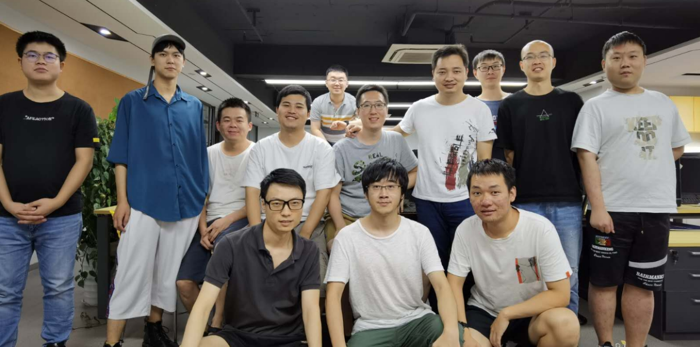

<!-- 

  Hey there! This page is included as an example. Feel free to customize it for your own use upon downloading. Carry on!

 -->

Tianfu Robotics is co-founded by [Kanzhi Wu](https://kanzhi.tech) at August 2017. 

We were focusing on building cement blasting and rendering robots for construction industry in our first two years. We developed a complicated yet effective system which consists a mobile base, a lifting system, an UR-10 robot arm and switchable end-effector at challenging construction sites. Our robots are able to navigate in the rough apartments without interior decoration, complete high accuracy scanning of the wall and conducted cement blasting and rendering tasks in millimeter accuacy in fully autonomous way.

Without a succesful commercialization for many reasons, we finally cut this project by the end of 2018 and dived into aesthetic industry. We design and build our customized high accuracy 3D scanning and analysis system for facial areas, breasts and also the whole bodies. Our system is able to collect 3D data, analyze 3D data and let the doctor and patient interact on the data even remotely. [Aist Aesthetic Group](http://aist.cn/index.html) is one of our flagship customers and our system have deployed in more than 50 hospitals nationalwide. 

You are welcome to visit blog for the detailed description and demonstration of our work!

  The above work cannot be done without the following group of people

